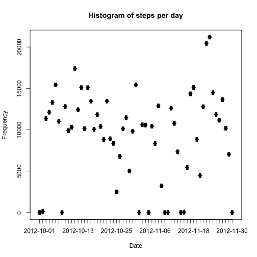
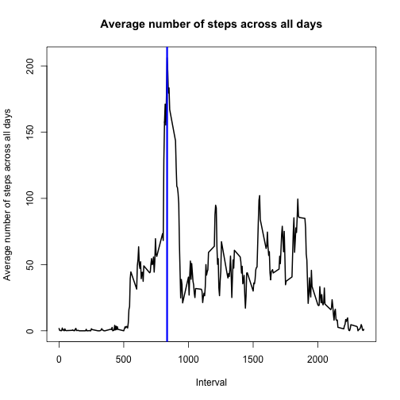
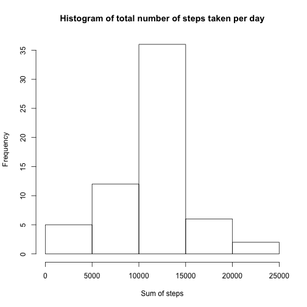
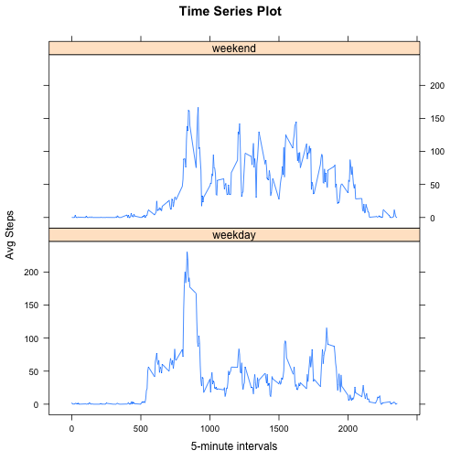

###Loading and preprocessing the data

Here, I am loading the data.

```r
setwd("/Users/emilyhsu/CourseEra/")
data<-read.csv("activity.csv")
```

###What is mean total number of steps taken per day?

Calculate the total number of steps taken per day, and make a histogram of the total steps taken each day.
Also report the mean and median of the total steps taken each day.

```r
stepsperday<-split(data$steps,data$date)
totalstepsperday<-sapply(stepsperday,sum,na.rm=TRUE)
plot(unique(data$date),totalstepsperday,main="Histogram of steps per day",xlab="Date",ylab="Frequency",type="h",lwd=4)
```

 

```r
meandata<-mean(totalstepsperday)
mediandata<-median(totalstepsperday)
print(paste0("Mean of the total number of steps taken per day: ",meandata))
```

```
## [1] "Mean of the total number of steps taken per day: 9354.22950819672"
```

```r
print(paste0("Median of the total number of steps taken per day: ",mediandata))
```

```
## [1] "Median of the total number of steps taken per day: 10395"
```

###What is the average daily activity pattern?

Make a time series plot of the 5-minute interval and the average number of steps taken, averaged across all days.
Observe which 5-minute interval, on average across all the days in the dataset, contains the maximum number of steps.

```r
interval<-split(data$steps,data$interval)
avgstepsperint<-sapply(interval,mean,na.rm=TRUE)
plot(unique(data$interval),avgstepsperint,type="l",main="Average number of steps across all days",xlab="Interval",ylab="Average number of steps across all days",lwd=2)
maxspot<-as.numeric(which(avgstepsperint==max(avgstepsperint,na.rm=TRUE)))
maxint<-unique(data$interval)[maxspot]
abline(v=maxint,lwd=3,col="blue")
```

 

```r
print(paste0("The 5-minute interval that contains the max number of steps is: ",maxint))
```

```
## [1] "The 5-minute interval that contains the max number of steps is: 835"
```

###Imputing missing values

Find the total number of missing values in the dataset.
Devise a strategy for filling in all of the missing values of the dataset.
The mean for that 5-minute interval was used as a strategy.
Create a new dataset equal to the original one but with missing data filled in.
Make a histogram of the total number of steps taken each day.
Find the mean and median total number of steps taken per day, and see if they differ from the estimates from the first part of the assignment.

```r
totalmissing<-sum(as.numeric(!complete.cases(data$steps)))
print(paste0("The total number of missing values in the dataset is: ",totalmissing))
```

```
## [1] "The total number of missing values in the dataset is: 2304"
```

```r
fillin<-data
meanint<-tapply(data$steps,data$interval,mean,na.rm=TRUE)
for (i in which(is.na(fillin))){
  fillin[i,1]<-meanint[((i-1)%%288)+1]
}
hist(tapply(fillin$steps,fillin$date,sum),main="Histogram of total number of steps taken per day",xlab="Sum of steps")
```

 

```r
meansteps<-mean(tapply(fillin$steps,fillin$date,sum),na.rm=TRUE)
mediansteps<-median(tapply(fillin$steps,fillin$date,sum),na.rm=TRUE)
```

###Are there differences in activity patterns between weekdays and weekends?

Create a new variable with weekday and weekend as the 2 levels.
Make a panel plot with a time series plot of the 5-minute interval and the average number of steps taken, averaged across all weekdays or weekends.

```r
weekend<-c("Saturday","Sunday")
day<-c()
for (i in 1:length(fillin$steps)){
  if (any(weekdays(as.Date(fillin[i,2]))==weekend)){
    day[i]<-"weekend"
  }else {
    day[i]<-"weekday"
  }
}
fillin<-cbind(fillin,day)
library(lattice)
splitted<-split(fillin,fillin$day)
wkdays<-do.call(rbind.data.frame,splitted[1])
wkend<-do.call(rbind.data.frame,splitted[2])
avginwkdays<-tapply(wkdays$steps,wkdays$interval,mean)
avginwkends<-tapply(wkend$steps,wkend$interval,mean)
interwkday<-as.data.frame(cbind(avginwkdays,as.numeric(as.character((names(avgstepsperint))))))
interwkend<-as.data.frame(cbind(avginwkends,as.numeric(as.character((names(avgstepsperint))))))
df.interwkday<-cbind(interwkday,rep("weekday",288))
df.interwkend<-cbind(interwkend,rep("weekend",288))
colnames(df.interwkday)<-c("avgsteps","interval","day")
colnames(df.interwkend)<-c("avgsteps","interval","day")
inter<-rbind(df.interwkday,df.interwkend)
xyplot(avgsteps ~ interval | day, inter,layout=c(1,2),type="l",main="Time Series Plot",xlab="5-minute intervals",ylab="Avg Steps")
```

 
